# ShopAdmin — Product Inventory Panel

A beautiful, secure, and fully functional CRUD application for product inventory management.
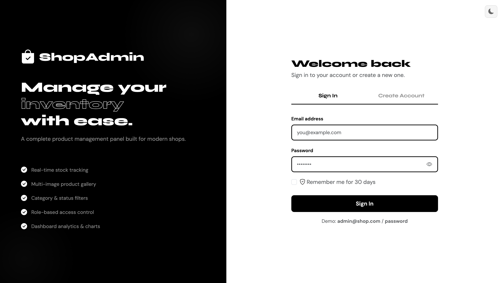

### Create Account
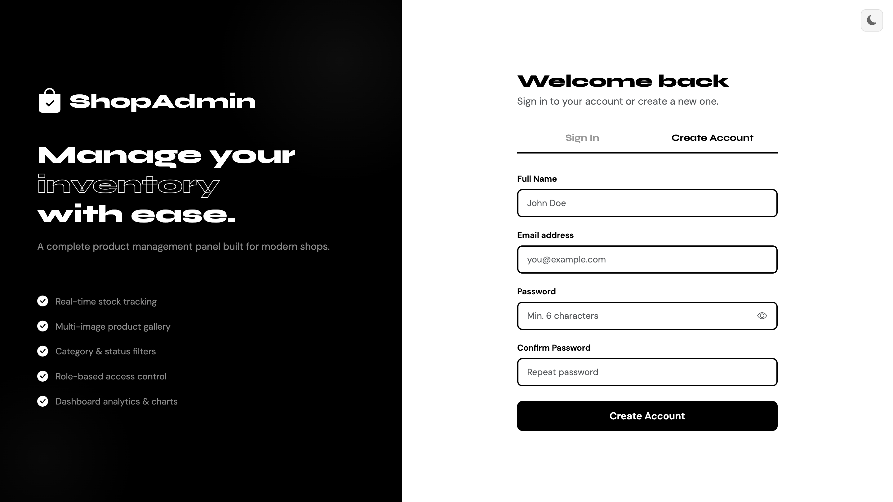

### Admin Dashboard
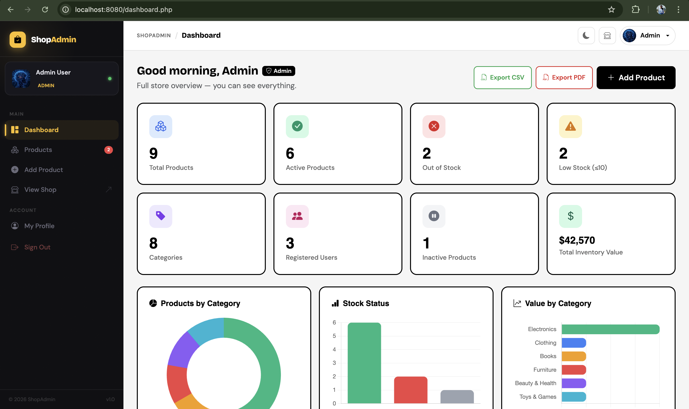

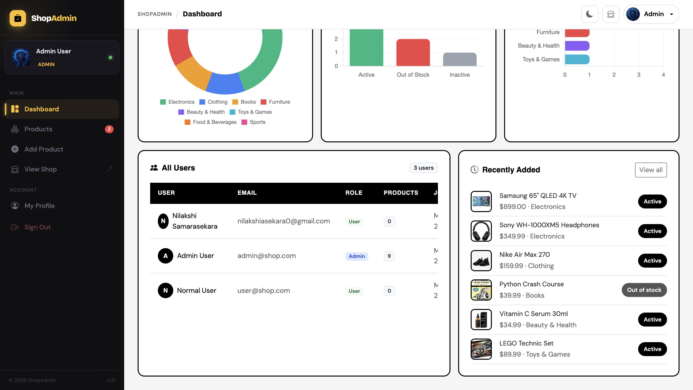

### User Dashboard
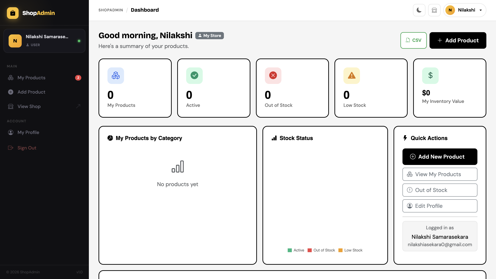

### Product Management
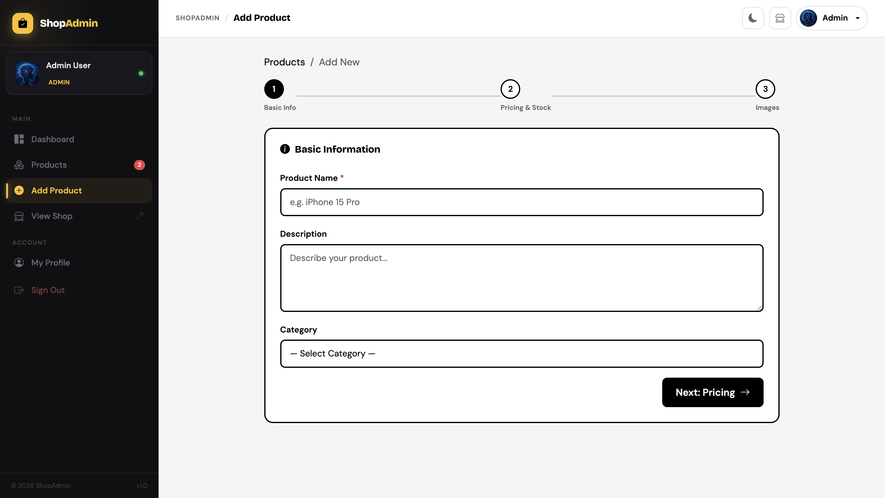

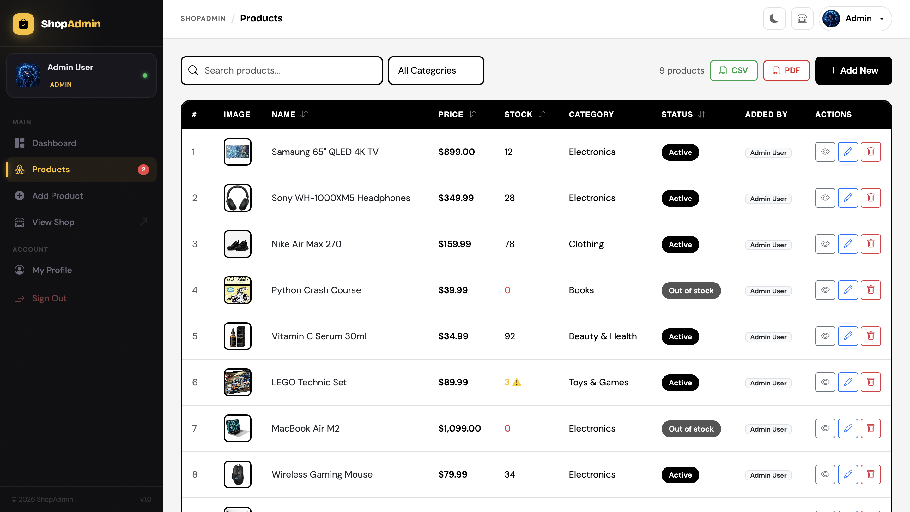

### Image Upload
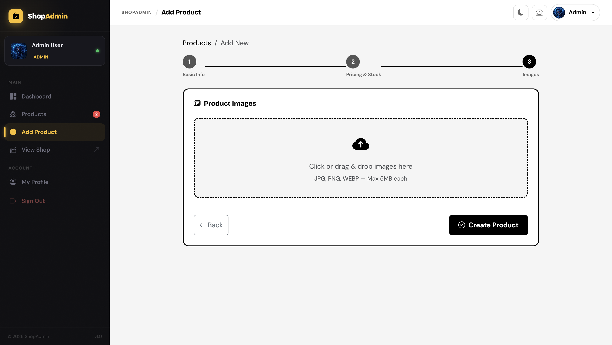

### Profile Management
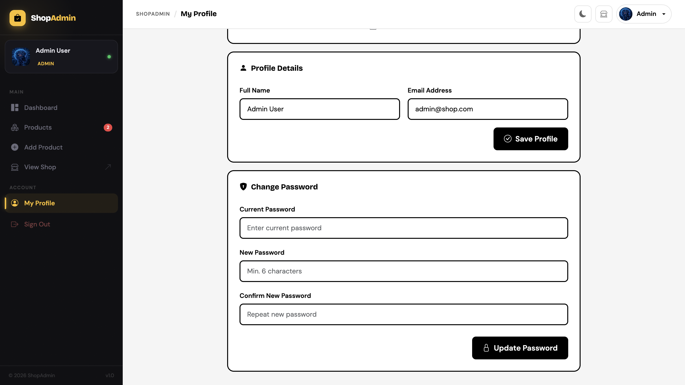

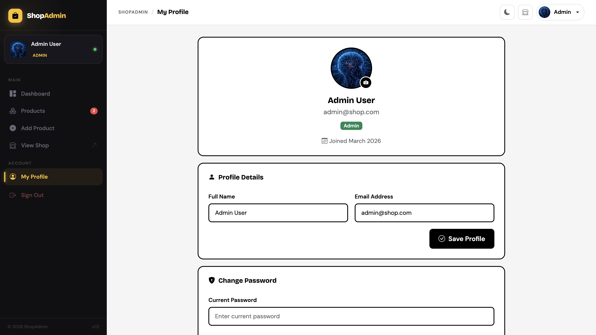

### Pricing Page
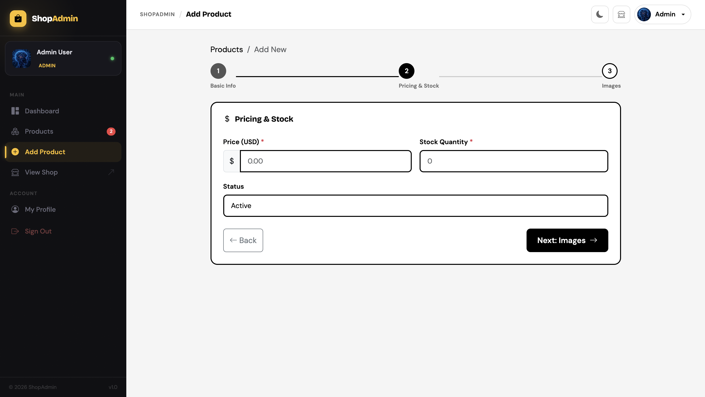

### PDF Export
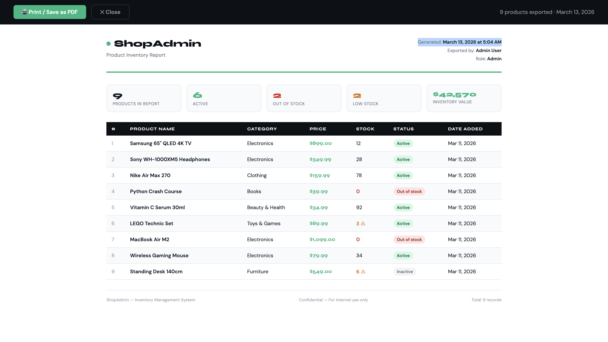

### Dark Mode
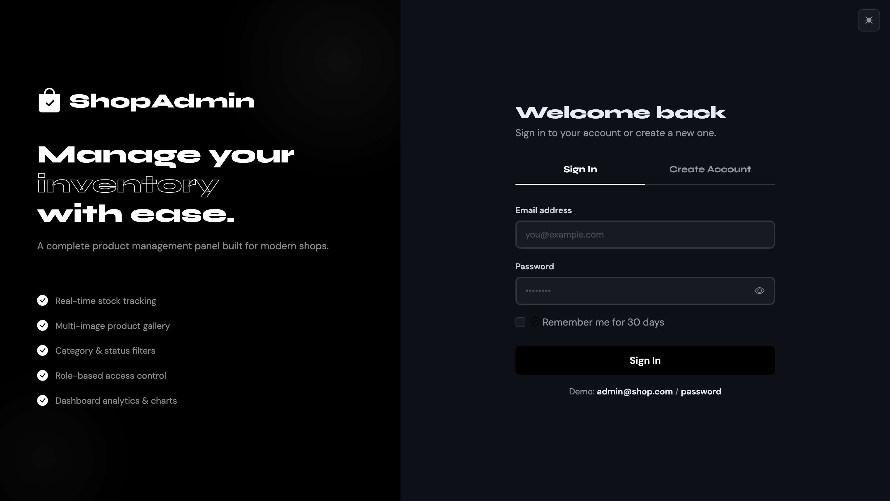

### Mobile Responsive Dashboard

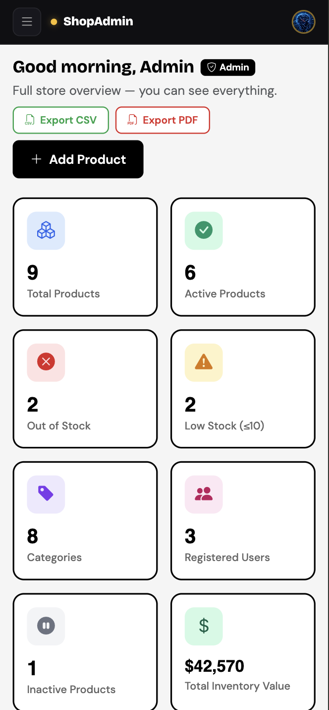

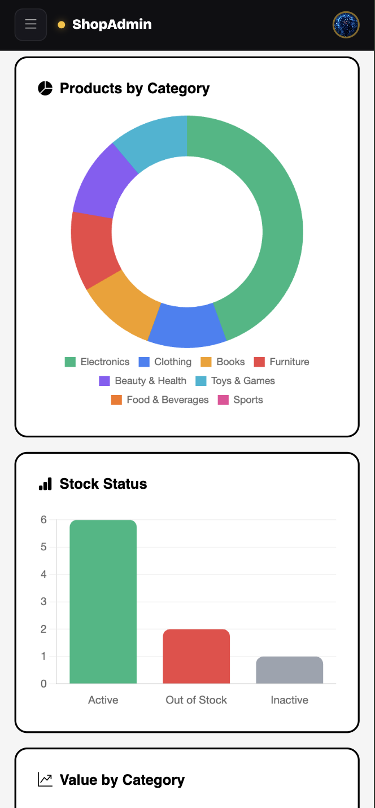

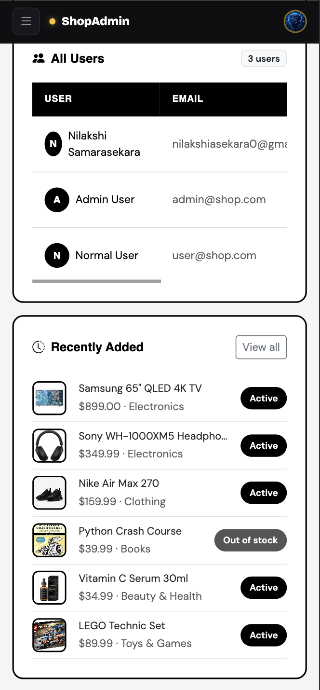
## 🔑 Default Login Credentials

| Role  | Email              | Password |
|-------|--------------------|----------|
| Admin | admin@shop.com     | password |
| User  | user@shop.com      | password |

## 🚀 Setup Instructions

### Prerequisites
- PHP 8.0+
- MySQL 5.7+ or MariaDB 10.3+
- Apache/Nginx with `mod_rewrite` enabled

### Step-by-Step Setup

1. **Clone/copy** the project into your web server root:
   ```
   /var/www/html/shop-admin/   (Apache)
   /usr/share/nginx/html/shop-admin/   (Nginx)
   ```
   Or place it in `htdocs/shop-admin/` for XAMPP/WAMP.

2. **Import the database:**
   ```bash
   mysql -u root -p < database.sql
   ```
   Or open phpMyAdmin → Import → select `database.sql`

3. **Configure database credentials** in `config.php`:
   ```php
   define('DB_HOST', 'localhost');
   define('DB_USER', 'root');       // your MySQL user
   define('DB_PASS', '');           // your MySQL password
   define('DB_NAME', 'shop_admin');
   ```

4. **Set uploads folder permissions:**
   ```bash
   chmod 755 uploads/
   ```

5. **Visit** `http://localhost/shop-admin/` in your browser.

---

## 📁 Project Structure

```
shop-admin/
├── config.php              # Database config
├── database.sql            # MySQL schema + seed data
├── index.php               # Login & Register
├── dashboard.php           # Dashboard with stats + charts
├── products.php            # Product list (search, filter, sort, paginate)
├── add_product.php         # Multi-step add product form
├── edit_product.php        # Edit product + manage images
├── view_product.php        # Product detail + image carousel
├── profile.php             # User profile management
├── logout.php              # Logout
├── classes/
│   ├── Database.php        # PDO singleton
│   ├── Auth.php            # Authentication (login/register/session)
│   ├── Product.php         # Product CRUD + image management
│   └── User.php            # User profile management
├── api/
│   ├── auth.php            # POST /api/auth.php
│   ├── products.php        # POST/GET /api/products.php
│   └── profile.php         # POST /api/profile.php
├── includes/
│   ├── header.php          # Shared sidebar + topbar layout
│   └── footer.php          # Shared footer + scripts
├── assets/
│   ├── css/style.css       # Custom styles
│   └── js/main.js          # JavaScript (AJAX, UI interactions)
└── uploads/                # User-uploaded images (auto-created)
```

---

## 🔌 API Endpoints

### Auth — `POST api/auth.php`
| Action     | Parameters                          | Description        |
|------------|-------------------------------------|--------------------|
| `login`    | email, password, remember           | Sign in user       |
| `register` | name, email, password, confirm_password | Create account |

### Products — `api/products.php`
| Action         | Method | Parameters                                     | Description            |
|----------------|--------|------------------------------------------------|------------------------|
| `list`         | GET    | search, category, sort, order, page, limit      | Paginated product list |
| `get`          | GET    | id                                              | Single product details |
| `create`       | POST   | name, description, price, stock, category_id, status, images[] | Create product |
| `update`       | POST   | id + same as create                            | Update product         |
| `delete`       | POST   | id                                              | Delete product (admin) |
| `delete_image` | POST   | image_id                                        | Remove product image   |
| `stats`        | GET    | —                                               | Dashboard stats        |
| `categories`   | GET    | —                                               | All categories         |

### Profile — `POST api/profile.php`
| Action            | Parameters                          | Description              |
|-------------------|-------------------------------------|--------------------------|
| `update_profile`  | name, email                         | Update name/email        |
| `update_password` | current_password, new_password, confirm_password | Change password |
| `update_picture`  | picture (file)                      | Upload profile photo     |

---

## 🗄️ ER Diagram

```
users
├── id (PK)
├── name
├── email (UNIQUE)
├── password (bcrypt)
├── role (admin|user)
├── profile_picture
└── remember_token

categories
├── id (PK)
└── name

products
├── id (PK)
├── name
├── description
├── price
├── stock
├── category_id (FK → categories)
├── status (active|inactive|out_of_stock)
└── created_by (FK → users)

product_images
├── id (PK)
├── product_id (FK → products)
├── image_path
└── sort_order
```

---

## ✨ Features

**Core:**
- Login & Register with form validation + toast notifications
- Remember Me (30-day persistent cookie)
- Role-based access (Admin can delete; Users can add/edit)
- Dashboard with 6 stat cards + Chart.js pie & bar charts
- Product list with search, category filter, column sort, pagination
- Multi-step Add Product form (info → pricing → images)
- Edit product with existing image management
- Product detail page with Bootstrap image carousel
- Profile page: update name/email, change password, upload avatar
- Responsive Bootstrap 5 — 100% mobile-first

**Bonus:**
- Chart.js dashboard analytics
- Dark sidebar design with emerald accent
- Drag & drop image upload with preview
- Low-stock warning badges in sidebar

---

## 🛠️ Tech Stack

| Layer      | Technology                              |
|------------|-----------------------------------------|
| Backend    | PHP 8 (OOP + API-style endpoints)       |
| Frontend   | HTML5, CSS3, JavaScript (Fetch API)     |
| Database   | MySQL (PDO with prepared statements)    |
| Styling    | Bootstrap 5.3 + Custom CSS             |
| Charts     | Chart.js 4                              |
| Icons      | Bootstrap Icons 1.11                    |
| Fonts      | Syne + DM Sans (Google Fonts)           |
# shopadmin
